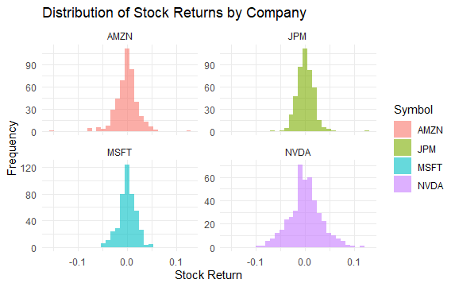
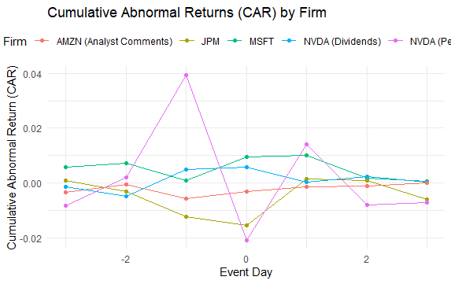

# News Events & Abnormal Stock Returns

This project explores the relationship between firm-specific news events and **abnormal stock returns**, using data from a Kaggle dataset. The analysis focuses on four major publicly listed companies — **Microsoft (MSFT), Nvidia (NVDA), Amazon (AMZN), and JPMorgan Chase (JPM)** — and investigates how different types of news affect stock price behavior.

---

## Objective

To test whether **firm-specific news events** lead to statistically significant **abnormal or cumulative abnormal returns (CARs)**, and whether certain types of events (e.g., operational vs. strategic) have different impacts on investor response.

---

## Methodology

- **Regression Model Specifications**
Abnormal returns estimated based on market model: yᵢₜ = α + β·yₜᵐ + εₜ
Abnormal returns given by: eᵢ_{τ,0} = yᵢ_τ − (α̂ + β̂·yᵐ_τ)
Cumulative abnormal return: CAR_event = ∑ (ARₜ)  from t = 1 to T

- **Event Study Framework**: Estimated market model using an estimation window; calculated abnormal and cumulative abnormal returns in event windows.
Event window: [t0-3; t0+3], t0 - event date
- **Regression Analysis**: Tested the effect of news volume on abnormal return magnitude.
- **Hypothesis Testing**: Used t-tests to determine statistical significance of CARs.
- **Data Visualization**: Histograms, CAR plots, and return distributions analyzed across companies and event types.

---

## Key Findings
- Return distributions deviated from normality, but large sample size justified the regression approach.

- News volume significantly influences the **magnitude** of abnormal returns.
- **Strategic and sentiment-related events** triggered stronger market reactions than routine announcements.
- **Statistically significant independent variables that influence AR** MSFT - corporate earnings (0.00002); JPM - corporate earnings (-0.001) NVDA - Personnel changes (-0.002), Dividends (0.001); AMZN - Analyst comments (-0.002)
- **Cumulative abnormal return analysis**
- Using t-test, CAR by companies showed statistical significance at different levels: MSFT (p = 0.03538), JPM (p = 0.01661), NVDA Dividents (p = 0.0885), NVDA personnel changes (p = 0.4669, insignificant), AMZN (p = 0.04313)

---

## Tools & Techniques

- **RStudio**
- Data source: Kaggle [firm-specific news dataset]
- Financial metrics: Abnormal Returns, Cumulative Abnormal Returns (CAR), Skewness, Kurtosis, Volatility

---

## Conclusion

News events significantly influence stock returns, especially earnings-related news.
Some events have stronger impacts than others, and market reactions vary.
This project demonstrates that **not all news is equal** — investors react differently depending on the **type and volume** of firm-specific events. 

---

## File Summary

- `setiment_AR.zip`: Contains data, Fama-French factors daily, and complete code for preprocessing, analysis, and visualization

